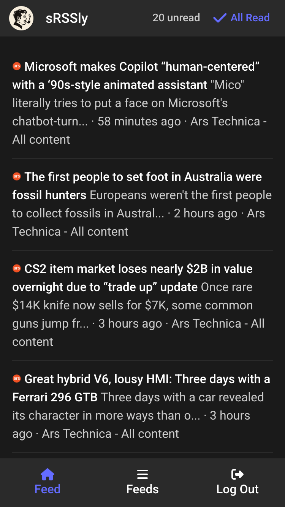

# 📰 sRSSly

> A minimalistic, modern RSS reader that takes reading seriously.

<p align="center">
  
</p>

## ✨ Features

- 📱 **Mobile-First Design** - Optimized for mobile devices (desktop view in progress)
- 📲 **PWA Support** - Install as a native app on your device
- 🌙 **Dark Mode** - Easy on the eyes, day or night
- ⚡ **Fast & Lightweight** - Built with performance in mind
- 🔄 **Auto-Discovery** - Automatically finds RSS/Atom feeds from any URL

## 🐳 Quick Start with Docker / Docker Compose

Create a file with the env variables:

```bash
# env.prod
NODE_ENV=production
DB_HOST=db
DB_NAME=srssly_production
DB_USERNAME=postgres
DB_PASSWORD=postgres
DB_PORT=5432
```

Run docker-compose:

```bash
docker compose up -d
```

### Initialize the database

```bash
docker compose run --rm app init-db
```

### Setup a cron job to fetch entries every 15 minutes

```bash
*/15 * * * * docker compose run --rm app fetch-entries
```

### Running the Application

```bash
# Development mode (both client and server)
npm run dev

# Server only
npm run dev:server

# Client only
npm run dev:client

# Production build
npm run build

# Start production server
npm start
```

## 🤝 Contributing

Contributions are welcome! Please feel free to submit a PR.

1. Fork the repository
2. Create your feature branch (`git checkout -b feature/AmazingFeature`)
3. Commit your changes (`git commit -m 'Add some AmazingFeature'`)
4. Push to the branch (`git push origin feature/AmazingFeature`)
5. Open a Pull Request

## 📝 License

This project is open source and available under the [MIT License](LICENSE).

<p align="center">
  Made with ☕ and 📰
</p>
